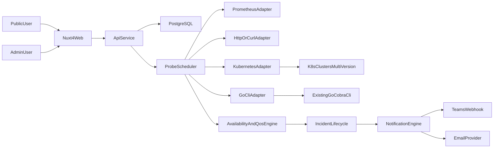

# DevOps Status Detailed Implementation Plan

## Inputs

- Requirements source: `[/home/devozs/workspace/intel/devops-status/plan/devops-status-hl-design.md](/home/devozs/workspace/intel/devops-status/plan/devops-status-hl-design.md)`
- Visual references: files in `[/home/devozs/workspace/intel/devops-status/plan/examples](/home/devozs/workspace/intel/devops-status/plan/examples)`

## Scope and Goals

- Public status site with Home and History (Incidents/Uptime).
- Service-level and Environment-level monitoring with two indicators:
  - Availability (up or down)
  - QoS (green, yellow, red)
- Admin area to manage services, environments, data sources, probe mappings, and incidents.
- Subscription notifications (phase 1: Teams + Email).
- Historical persistence for uptime, QoS, incidents, and metadata.

## Key Architecture Decision

- **Frontend:** Nuxt 4 (as requested).
- **Persistence:** PostgreSQL.
- **Baseline backend recommendation:** Go.
- **Alternative backend option:** Node.js + TypeScript (if needed later for specific ecosystem reasons).

## Admin Area and Authentication Plan

### Phase 0 (explicitly added)

- Introduce a dedicated Admin area (`/admin`) separated from public pages.
- Use simple username/password login for initial rollout.
- Keep role model minimal in phase 0:
  - `admin` role only
  - session-based auth (httpOnly cookie) with CSRF protection
- Keep the previously planned security controls:
  - RBAC-ready middleware
  - input validation
  - audit logging for admin actions
  - secret redaction in logs

### Later phase (Microsoft Active Directory integration)

- Add enterprise SSO with Microsoft Entra ID / Azure AD via OIDC (recommended) or SAML.
- Replace/disable local password login after AD cutover (or keep as break-glass account).
- Map AD groups to app roles (`status-admin`, future `status-editor`).
- Keep existing session and RBAC layers so only identity provider changes.

## Backend Approach (Go First)

## Why Go as Primary Backend

- Strongest alignment with your existing Go-based ecosystem (CLI, exporters, Kubernetes-oriented tooling).
- Easier long-term ownership of status extraction logic and probe integrations.
- High performance for concurrent sampling and lightweight deployment as a single static binary.
- Cleaner reuse of existing Go libraries and domain logic without language-bridge overhead.

## Recommended Go Stack

- HTTP/API: Chi (or Gin/Fiber if team preference differs).
- Scheduler/workers: `robfig/cron` plus controlled worker pool.
- Database: `pgx` + `sqlc` for typed query safety (or GORM if team prefers ORM).
- Auth: session auth for phase 0 local admin login; OIDC with Microsoft Entra ID later.
- Contracts: OpenAPI-generated spec consumed by Nuxt.
- Kubernetes access: official `client-go` + dynamic client for version-tolerant discovery.

## Kubernetes Data Source Support (Mandatory)

- Add Kubernetes as a first-class data source adapter in addition to Prometheus/HTTP/CLI.
- Support extracting both:
  - Operational status (service availability checks)
  - QoS indicators (latency/error/resource health derived from Kubernetes objects and metrics paths)
- Allow admin to bind a service or an environment to one or more Kubernetes-based checks.
- Keep K8s adapter design independent from curl/cli/http adapters because K8s API-version complexity is unique.

## Kubernetes Onboarding Handshake (Automated Access Setup)

- When admin adds a Kubernetes environment, onboarding must include an automated handshake between status app BE and target cluster.
- Use an agent/bootstrap pattern similar to Rancher-style onboarding:
  - Status app generates cluster-specific onboarding instructions and a one-time registration manifest/command.
  - Admin runs the provided command on target cluster.
  - A lightweight status-agent (or bootstrap job) registers cluster identity and establishes trust.
  - Backend validates handshake and marks cluster as `connected`.
- The onboarding flow should be guided and explicit in admin UI:
  - Step 1: create environment + cluster profile
  - Step 2: copy/run generated command in target cluster
  - Step 3: observe callback/registration
  - Step 4: run capability scan and finalize
- Handshake security requirements:
  - short-lived registration tokens
  - cluster-scoped least-privilege RBAC for agent/service account
  - rotation and revocation support
  - full onboarding audit trail

## Multi-Cluster and API Version Compatibility Strategy

- Introduce a `k8s_cluster` registry in admin:
  - cluster name, environment label, API server endpoint
  - auth method (service account token, kubeconfig, or cloud IAM integration later)
  - default namespace scope and allowed namespace filters
- For each cluster, run capability discovery at onboarding and periodically:
  - supported Kubernetes version
  - available API groups/versions/resources (`GroupVersionResource`)
  - preferred vs deprecated API versions
- Store probe definitions in a version-tolerant format:
  - target by logical resource intent first (for example Deployment health)
  - keep per-cluster resolved `GroupVersionResource` mapping
- Add compatibility resolver in backend:
  - choose best supported API version per cluster at runtime
  - fallback to alternate supported versions if preferred one is unavailable
  - mark probe as configuration error only when no compatible mapping exists
- Add optional per-cluster override in admin for edge cases.
- Keep an adapter capability matrix visible in admin so operators can see which checks are supported per cluster version.
- Persist handshake lifecycle per cluster:
  - `pending_registration` -> `registered` -> `connected` -> `degraded`/`revoked`

## Repository Layout (Root `devops-status`)

- `devops-status-fe/`
  - Nuxt 4 application (public pages + admin UI).
- `devops-status-be/`
  - Go backend service (APIs, scheduler, probe adapters, notifications).
- `devops-status-dev/` (Docker Compose: PostgreSQL + dev tunnel; `db/` holds migrations and seeds)
  - Development database assets:
    - SQL migrations
    - seed scripts
    - local DB bootstrap helpers
    - optional DB-only container config

## Node as Optional Alternative

- If Node is ever selected in a future variant, it would integrate with Go probes through:
  - existing Go CLI execution with structured JSON output, or
  - a dedicated internal Go probe service over HTTP/gRPC.

## Development Persistence Policy

- Primary DB remains PostgreSQL in all environments.
- Prefer local development without full docker-compose orchestration.
- If containerization is needed, use it only for DB:
  - DB-only docker-compose (or equivalent single-container run) is allowed.
  - FE and BE should run directly on the host during development.
- Keep persistence workflow consistent:
  - run migrations from `devops-status-dev/db/migrations/`
  - run seeds from `devops-status-dev/db/seeds/`
  - keep local Postgres data persisted between restarts

## System Overview

## Data Model (Detailed)

- `environments`
  - identity, display metadata, visibility, criticality, environment type (`dev`/`staging`/`prod` or custom)
- `environment_service_membership`
  - many-to-many mapping of services to environments for grouped status and drill-down
- `services`
  - identity, display metadata, visibility, criticality
- `data_sources`
  - type: `operational` or `qos`
  - adapter: `prometheus` | `http` | `cli` | `kubernetes`
  - config JSON, timeout/retry, secret refs
- `k8s_clusters`
  - cluster identity, endpoint, auth reference, environment, namespace policy, last capability scan
- `k8s_cluster_handshakes`
  - registration token metadata, issued/expiry, handshake status, last heartbeat, revocation info
- `k8s_cluster_credentials`
  - secure references for issued credentials/certs (never plain text in DB)
- `k8s_api_capabilities`
  - discovered API groups/versions/resources per cluster, deprecation markers, preferred mappings
- `k8s_probe_templates`
  - logical check definitions independent of cluster API version
- `k8s_probe_resolutions`
  - resolved cluster-specific `GroupVersionResource` mapping for runtime probe execution
- `service_probe_bindings`
  - maps each service to operational and qos data sources
- `environment_probe_bindings`
  - maps each environment to operational and qos data sources
  - sampling interval, smoothing window, debounce thresholds
- `qos_policies`
  - threshold ranges for green/yellow/red at service or environment scope
- `sample_results`
  - timestamp, probe result, latency, parsed values, metadata, target type (`service` or `environment`)
- `status_rollups`
  - bucketed status for fast timeline rendering (daily/hourly) for both services and environments
- `incidents` and `incident_updates`
  - lifecycle states and user-visible messages; linked to service and/or environment target
- `subscriptions` and `notification_events`
  - channel targets, verification status, send outcomes
- `admin_users` (phase 0 local auth)
  - username, password hash, status, last_login

## Public UX Plan (from examples)

- Home page:
  - global banner (`All Systems Operational` or disruption)
  - environment-level summary section/cards (same indicator style as services)
  - per-service 90-day color bars
  - per-environment 90-day color bars
  - hover tooltip: date + downtime + related incident summary
  - “Past incidents” section
- History page:
  - tabs: `Incidents` and `Uptime`
  - target switch/filter: `Services` / `Environments`
  - incident list grouped by month
  - uptime month grid with percentages and selector for service or environment
- Subscribe panel:
  - compact popover/modal with channel options

## Admin UX Plan

- `/admin/login` (phase 0 local auth)
- `/admin/services` (CRUD)
- `/admin/environments` (CRUD)
- `/admin/environment-membership` (assign services to environments)
- `/admin/data-sources` (CRUD + adapter forms)
- `/admin/k8s-clusters` (cluster onboarding, credentials, namespace scope, capability scan)
- `/admin/k8s-onboarding` (wizard with generated install command/manifest and live registration status)
- `/admin/k8s-compatibility` (view/override API version resolution and unsupported checks)
- `/admin/bindings` (map service/environment -> operational/qos checks)
- `/admin/incidents` (manual updates/overrides)
- `/admin/subscriptions` (view/revoke)

## API Plan

- Public:
  - `GET /api/public/status/summary`
  - `GET /api/public/status/environments`
  - `GET /api/public/services`
  - `GET /api/public/environments`
  - `GET /api/public/services/:slug/history`
  - `GET /api/public/environments/:slug/history`
  - `GET /api/public/incidents`
  - `GET /api/public/incidents/:id`
  - `POST /api/public/subscriptions/email`
  - `POST /api/public/subscriptions/teams`
- Admin:
  - auth login/logout/session endpoints
  - services/environments/data-sources/bindings CRUD
  - environment membership CRUD
  - k8s cluster CRUD + capability scan endpoints
  - k8s onboarding endpoints:
    - create handshake token
    - generate onboarding manifest/command
    - receive/validate registration callback
    - heartbeat/status endpoint for registered agent
    - revoke/rotate cluster credentials
  - k8s compatibility resolution/override endpoints
  - probe test endpoint
  - incident update endpoints

## Execution and Security for CLI/Go Integration

- Restrict executable allowlist and argument schema.
- Enforce timeout, retry, memory/cpu caps.
- Run probes under a low-privilege runtime user.
- Capture stdout/stderr and exit code with redaction.
- Store only references to secrets; load at runtime from secure source.
- Prefer direct in-process Go adapters where possible; use external CLI execution only where required by existing tooling boundaries.

## Execution and Security for Kubernetes Handshake

- Generate onboarding assets per cluster with short TTL.
- Use mTLS or signed token-based registration for backend-agent trust establishment.
- Enforce minimal RBAC manifests for agent permissions.
- Keep agent upgrade/uninstall instructions versioned in admin.
- Implement heartbeat monitoring and automatic `degraded` state on missed heartbeats.
- Support immediate credential revocation from admin.

## Phased Delivery

## Phase 0 - Foundations + Admin Access

- Project bootstrap with root folders: `devops-status-fe`, `devops-status-be`, `devops-status-dev` (includes `db/`, `tunnel/`, and `docker-compose.yml`).
- PostgreSQL schema baseline.
- Public page scaffold.
- Admin area scaffold.
- Local username/password auth for admin.
- Core security middleware (RBAC-ready, CSRF, validation, audit logs).
- Go API service skeleton (routing, config, DB layer, health checks).
- Local development scripts that run FE/BE on host and DB separately.
- Add foundational schema and admin CRUD for `environments`.

## Phase 1 - Core Status Platform

- Data source adapters (Prometheus, HTTP/cURL, Kubernetes).
- Scheduler + sampling + status evaluation.
- Home + History pages with live DB data.
- Incident lifecycle (open/update/resolve) baseline.
- OpenAPI contract publication for Nuxt integration.
- Kubernetes cluster registry and capability discovery baseline.
- Environment-level status/QoS ingestion and rendering parity with services.
- Kubernetes onboarding handshake MVP (wizard + generated command/manifest + registration validation).

## Phase 2 - Go/CLI Probe Integration

- Direct Go integrations for existing probe logic where possible.
- Secure CLI adapter for existing Go Cobra tool where direct reuse is not practical.
- Parse timestamped step output for QoS metrics.
- Admin probe testing and troubleshooting view.
- Kubernetes version compatibility resolver hardening and per-cluster override UX.
- Kubernetes handshake hardening:
  - credential rotation/revocation
  - heartbeat health + reconnect handling
  - agent version compatibility checks

## Phase 3 - Subscriptions

- Email subscription + confirmation flow.
- Teams webhook subscriptions.
- Notification retries, deduplication, and delivery audit.

## Phase 4 - Hardening and Scale

- Partitioning/retention for sample history.
- Performance tuning for history queries.
- Observability dashboards and alerting.
- AD/OIDC integration rollout prep.

## AD Integration Plan (Post-MVP)

- Add OIDC with Microsoft Entra ID.
- Group-to-role mapping and role claims validation.
- Login UX switch from local auth to SSO.
- Break-glass admin policy and operational runbook.

## Testing Plan

- Unit tests: adapters, status logic, incident transitions.
- Integration tests: API + DB + scheduler + fake probe sources.
- Kubernetes compatibility tests:
  - validate probe execution across multiple mocked cluster versions
  - validate fallback from preferred to alternate API versions
  - validate admin override behavior and error surfacing
- Kubernetes onboarding tests:
  - token issue/expiry, registration success/failure paths
  - onboarding manifest correctness
  - heartbeat, revoke, and re-register flows
- E2E tests: Home, History tabs, tooltips, admin login, services CRUD, environments CRUD, membership mapping, and target filters.
- Security tests: auth/session, CSRF, input validation, command allowlist.

## Risks and Mitigations

- Command execution risk -> allowlist + sandbox + strict limits.
- Probe noise/false alarms -> debounce windows and threshold smoothing.
- High data volume -> partitions + rollups + retention jobs.
- Auth migration risk (local -> AD) -> keep auth abstraction and phased cutover.
- Kubernetes version skew risk -> capability discovery + resolver + per-cluster override + compatibility matrix in admin.
- Environment-service model complexity risk -> clear ownership model (independent status per environment plus optional service rollup), explicit API contracts, and dedicated admin validation screens.
- Kubernetes onboarding security risk -> short-lived tokens, least-privilege RBAC, mTLS/signed registration, heartbeat monitoring, and fast revocation.

## Initial Deliverables

- Working public status pages.
- Working admin area with local login.
- Configurable service/environment/data source mappings.
- Continuous status sampling and incident generation.
- Teams and Email subscription notifications.

