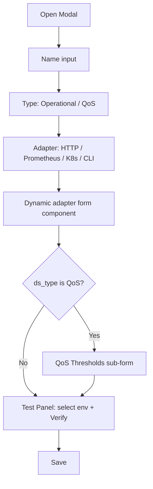
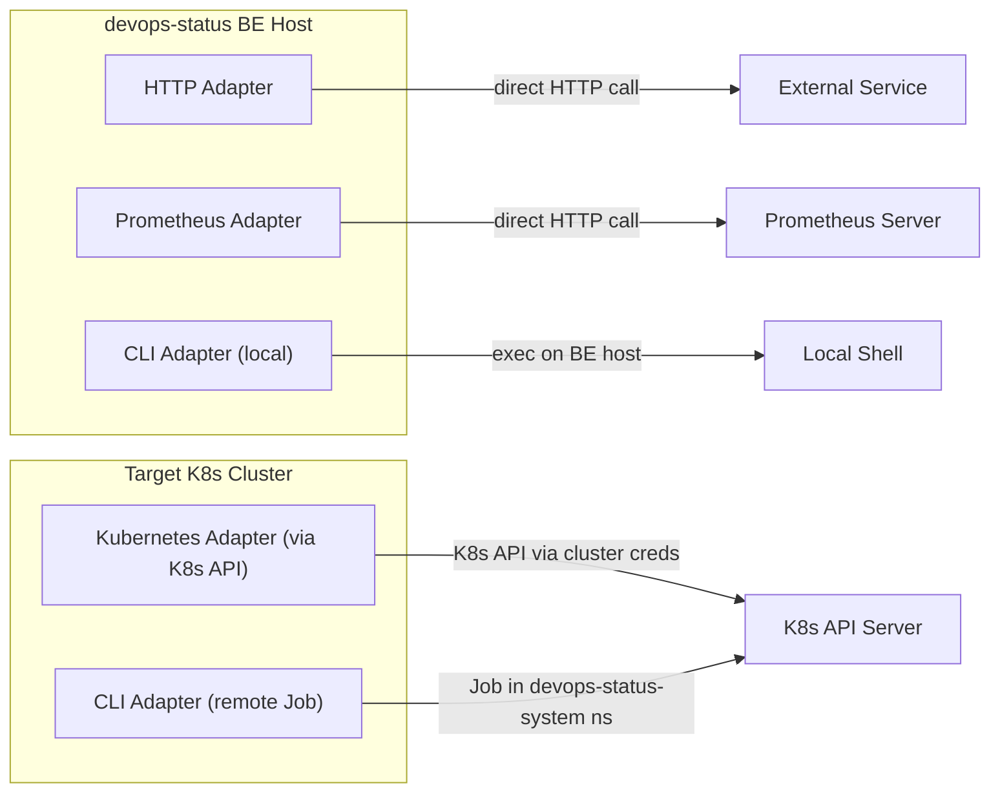

---

name: Datasource Specification Hardening
overview: Replace the generic Config JSON / Timeout form with adapter-aware, type-aware structured forms that enforce validation at design time, support per-adapter connectivity testing against a real environment, and add QoS threshold configuration -- applied end-to-end across FE, BE API, adapters, and DB schema.
todos:

- id: db-migration
content: "Create migration 004: add qos_thresholds and execution_target columns to data_sources; add secrets table for encrypted secret storage; drop and recreate data_sources clean (no backward compat)"
status: pending
- id: fe-types
content: Create devops-status-fe/types/datasource.ts with all adapter config and QoS threshold interfaces
status: pending
- id: be-validation
content: Create datasource_validation.go with per-adapter config validation (URL regex, required fields, K8s namespace regex, CLI allowlist, QoS threshold checks)
status: pending
- id: be-model-update
content: Update DataSource model and CreateDataSourceInput to include QosThresholds; update store queries for new column
status: pending
- id: be-handler-update
content: Update datasources.go Create/Update handlers to call structured validation before persisting
status: pending
- id: be-secret-store
content: "Implement secret store abstraction: SecretStore interface with DB-encrypted backend (AES-256-GCM). Write/Read/Delete secrets via secret_ref. Prometheus passwords, bearer tokens, and K8s tokens stored only via secret_ref -- never in config_json."
status: pending
- id: be-prometheus-auth
content: Add auth support to PrometheusConfig using secret_ref for credentials; resolve secrets at probe time via SecretStore; add TestConnectivity method
status: pending
- id: be-probetest-env
content: Update probetest.go to accept environment_id, ds_type, test_connect_only, qos_thresholds; return qos_level in response
status: pending
- id: be-adapter-execution-target
content: "Implement execution target routing: HTTP/Prometheus run on BE, Kubernetes runs on target K8s cluster, CLI has user-selectable target (BE or K8s). Add execution_target field to CLI config and K8s remote execution via Job."
status: pending
- id: fe-http-form
content: Build DatasourceHttpForm.vue with URL validation, method dropdown, headers editor, body textarea, expected status
status: pending
- id: fe-prometheus-form
content: "Build DatasourcePrometheusForm.vue with endpoint, auth method selector (none/basic/bearer), credential inputs (sent separately, never in config_json), test connectivity button, PromQL editor, threshold/operator"
status: pending
- id: fe-kubernetes-form
content: Build DatasourceKubernetesForm.vue with version dropdown (1.26-1.32), check type, namespace, resource name, label selector
status: pending
- id: fe-cli-form
content: "Build DatasourceCliForm.vue with execution target selector (Backend / K8s Cluster), command input, args, env vars, parse_json toggle; CLI QoS shows three command blocks"
status: pending
- id: fe-qos-thresholds
content: Build DatasourceQosThresholds.vue that renders latency-based or metric-based or command-based threshold inputs per adapter
status: pending
- id: fe-test-panel
content: Build DatasourceTestPanel.vue with environment selector, k8s version filtering, Verify button, result display with QoS level
status: pending
- id: fe-form-modal
content: Build DatasourceFormModal.vue orchestrating name/type/adapter selection and dynamic component rendering
status: pending
- id: fe-page-rewrite
content: "Rewrite data-sources.vue: replace inline modal with DatasourceFormModal, update table columns, remove Config JSON and Timeout fields"
status: pending
- id: be-qos-engine
content: Update status.go evaluateQoS to read per-datasource qos_thresholds instead of hardcoded 99/95 pass rates
status: pending
isProject: false

---

# Data Source Specification Hardening -- Detailed Implementation Plan

## Context

The current "Create Data Source" form ([devops-status-fe/pages/admin/data-sources.vue](devops-status-fe/pages/admin/data-sources.vue)) is a generic modal with free-form Config JSON and a Timeout field. It provides no guidance, no input validation, and no adapter-specific UI. The HL design (#4) requires replacing this with structured, adapter-aware forms that differ by Type (Operational vs QoS) and Adapter (HTTP, Prometheus, Kubernetes, CLI), with inline connectivity testing against a temporary environment binding.

### Key files that change

- **FE:** [devops-status-fe/pages/admin/data-sources.vue](devops-status-fe/pages/admin/data-sources.vue) (complete rewrite of modal)
- **FE:** new `devops-status-fe/types/datasource.ts` (shared TS types)
- **FE:** new `devops-status-fe/components/datasource/` (per-adapter form components)
- **BE handler:** [devops-status-be/internal/handler/admin/datasources.go](devops-status-be/internal/handler/admin/datasources.go) (structured validation)
- **BE handler:** [devops-status-be/internal/handler/admin/probetest.go](devops-status-be/internal/handler/admin/probetest.go) (environment-scoped test)
- **BE adapters:** [devops-status-be/internal/adapter/](devops-status-be/internal/adapter/) (all four files)
- **BE model:** [devops-status-be/internal/model/models.go](devops-status-be/internal/model/models.go)
- **DB migration:** new `devops-status-dev/db/migrations/004_datasource_structured_config.up.sql`

---

## 1. DB Schema Migration (004)

**No backward compatibility.** This migration drops and recreates `data_sources` cleanly. Any existing rows from development/testing are discarded. The new schema is purpose-built for structured adapter configs.

```sql
-- Drop existing data (no backward compat -- clean slate)
DELETE FROM environment_probe_bindings;
DELETE FROM service_probe_bindings;
DELETE FROM data_sources;

-- Add new columns to data_sources
ALTER TABLE data_sources
  ADD COLUMN IF NOT EXISTS qos_thresholds JSONB NOT NULL DEFAULT '{}',
  ADD COLUMN IF NOT EXISTS execution_target VARCHAR(20) NOT NULL DEFAULT 'backend'
    CHECK (execution_target IN ('backend', 'k8s_cluster'));

-- Encrypted secrets table (production-grade from day one)
CREATE TABLE IF NOT EXISTS secrets (
  id          UUID PRIMARY KEY DEFAULT gen_random_uuid(),
  owner_type  VARCHAR(50) NOT NULL,   -- 'data_source', 'k8s_cluster', etc.
  owner_id    UUID NOT NULL,
  key         VARCHAR(100) NOT NULL,  -- 'prometheus_password', 'bearer_token', etc.
  cipher_text BYTEA NOT NULL,         -- AES-256-GCM encrypted value
  nonce       BYTEA NOT NULL,
  created_at  TIMESTAMPTZ NOT NULL DEFAULT now(),
  updated_at  TIMESTAMPTZ NOT NULL DEFAULT now(),
  UNIQUE(owner_type, owner_id, key)
);
```

`qos_thresholds` stores the red/yellow/green thresholds per data source when `ds_type = 'qos'`:

- HTTP/Kubernetes QoS: `{ "green_max_ms": 200, "yellow_max_ms": 500 }` (latency-based)
- Prometheus QoS: `{ "green_operator": "gte", "green_threshold": 99, "yellow_operator": "gte", "yellow_threshold": 95 }` (metric-based)
- CLI QoS: `{ "green_command": "...", "yellow_command": "...", "red_command": "..." }` (three separate executions)

`execution_target` defines where the probe runs:

- `backend` -- HTTP, Prometheus, and optionally CLI execute on the devops-status BE process
- `k8s_cluster` -- Kubernetes adapter always runs on the target K8s cluster; CLI can run here if user selects it

---

## 2. FE Types (`devops-status-fe/types/datasource.ts`)

Define discriminated union types for each adapter config and QoS thresholds:

```typescript
export type AdapterType = 'http' | 'prometheus' | 'kubernetes' | 'cli'
export type DSType = 'operational' | 'qos'

export interface HttpConfig {
  url: string
  method: 'GET' | 'POST' | 'PUT' | 'DELETE' | 'HEAD'
  headers?: Record<string, string>
  body?: string
  expected_status?: number
}

export interface PrometheusConfig {
  endpoint: string
  auth_method: 'none' | 'basic' | 'bearer'
  // Actual credentials never stored here -- only secret_ref IDs
  // FE sends plaintext on create; BE encrypts and stores in secrets table
  query: string
  threshold?: number
  operator?: 'gt' | 'gte' | 'lt' | 'lte' | 'eq'
}

export interface KubernetesConfig {
  cluster_id: string
  k8s_version: string
  check_type: 'api_health' | 'deployment_ready' | 'pod_status' | 'node_status'
  namespace?: string
  resource_kind?: string
  resource_name?: string
  label_selector?: string
}

export interface CliConfig {
  command: string
  args: string[]
  env?: Record<string, string>
  parse_json: boolean
  execution_target: 'backend' | 'k8s_cluster'
}

export interface HttpQosThresholds {
  green_max_ms: number
  yellow_max_ms: number
}

export interface PrometheusQosThresholds {
  green_operator: string; green_threshold: number
  yellow_operator: string; yellow_threshold: number
}

export interface CliQosThresholds {
  green_command: string; green_args: string[]
  yellow_command: string; yellow_args: string[]
  red_command: string; red_args: string[]
}

export type DataSourceConfig = HttpConfig | PrometheusConfig | KubernetesConfig | CliConfig
```

---

## 3. FE Component Architecture

Replace the inline modal in `data-sources.vue` with a multi-step form that changes inputs based on Type + Adapter selection.

### 3.1 New components under `devops-status-fe/components/datasource/`


| Component                      | Responsibility                                                                        |
| ------------------------------ | ------------------------------------------------------------------------------------- |
| `DatasourceFormModal.vue`      | Outer modal shell, step orchestration, save/cancel                                    |
| `DatasourceHttpForm.vue`       | HTTP adapter fields (URL with regex validation, method, headers, expected status)     |
| `DatasourcePrometheusForm.vue` | Prometheus fields (endpoint, auth, PromQL editor, threshold/operator for operational) |
| `DatasourceKubernetesForm.vue` | K8s fields (version dropdown 1.26-1.32, check type, namespace, resource)              |
| `DatasourceCliForm.vue`        | CLI fields (command, args, env vars, parse_json toggle)                               |
| `DatasourceQosThresholds.vue`  | QoS threshold sub-form, shown when `ds_type === 'qos'` (content varies per adapter)   |
| `DatasourceTestPanel.vue`      | Environment selector + "Verify" button + result display                               |


### 3.2 Form flow




### 3.3 Adapter form details

**HTTP (Operational)**

- URL: text input with URL regex validation (`^https?://`)
- Method: dropdown (GET, POST, PUT, DELETE, HEAD), default GET
- Headers: key-value pair editor (add/remove rows)
- Body: textarea (shown only for POST/PUT)
- Expected Status: number input, default 200

**HTTP (QoS)** -- same base fields plus:

- Green max latency (ms): number input
- Yellow max latency (ms): number input
- (Red is implied: anything above yellow)

**Prometheus (Operational)**

- Endpoint URL: text input with URL regex
- Auth Method: radio group -- None / Basic Auth / Bearer Token
  - Basic Auth: username + password inputs (password type, masked)
  - Bearer Token: token input (password type, masked)
  - Credentials are sent in a separate `credentials` field on save, encrypted by BE via SecretStore. On edit, shows "Credentials saved" indicator with option to replace.
- "Test Connectivity" button (hits endpoint `/api/v1/status/config` to verify reachable with current credentials)
- PromQL: textarea with monospace font
- Threshold + Operator: number + dropdown (gt/gte/lt/lte/eq)
- Result interpretation: success = `true` (operational) / `false` (down)

**Prometheus (QoS)** -- same base + auth (via SecretStore) + PromQL, but thresholds section:

- Green: operator + threshold value
- Yellow: operator + threshold value
- Red: anything outside green/yellow

**Kubernetes (Operational)**

- K8s Version: dropdown from 1.26 to 1.32 (latest)
- Check Type: dropdown (api_health, deployment_ready, pod_status, node_status)
- Namespace: text input (shown for deployment/pod checks)
- Resource Name: text input (shown for deployment check)
- Label Selector: text input (shown for node/pod checks)
- Resource is operational if valid, available, and in ready state

**Kubernetes (QoS)** -- same base K8s fields plus:

- Green max latency (ms): number input (time for K8s API call)
- Yellow max latency (ms): number input

**CLI (Operational)**

- **Execution Target**: radio group -- "Run on Backend (devops-status BE)" or "Run on K8s Cluster"
  - If "K8s Cluster" is selected: user must also select which K8s environment (same env selector as test panel); the CLI command will run as a Job in the `devops-status-system` namespace on that cluster
  - If "Backend" is selected: command runs directly on the devops-status BE host process
- Command: text input (validated against allowlist: curl, kubectl, go)
- Args: tag-style input or textarea (space-separated)
- Env Vars: key-value editor
- Parse JSON output: toggle
- User must provide execution that returns true/false (exit 0 = operational)

**CLI (QoS)** -- three separate command blocks:

- Green execution: command + args
- Yellow execution: command + args
- Red execution: command + args
- Each block must return true/false; the first one (in green->yellow->red order) that returns true determines the level

### 3.4 Inline validation rules


| Field                 | Validation                                                         |
| --------------------- | ------------------------------------------------------------------ |
| Name                  | Required, min 2 chars, alphanumeric + hyphens                      |
| URL (HTTP/Prometheus) | Required, must match `^https?://[^\s]+$`                           |
| PromQL                | Required when adapter is prometheus                                |
| K8s Version           | Required, must be in `['1.26','1.27',...,'1.32']`                  |
| Namespace             | Optional but if provided, K8s-valid (`^[a-z0-9][a-z0-9\-]{0,62}$`) |
| Resource Name         | Required for deployment_ready check                                |
| CLI Command           | Required, must be in allowlist                                     |
| QoS Thresholds        | green < yellow for latency-based; all required for CLI QoS         |
| Green max ms          | Must be > 0                                                        |
| Yellow max ms         | Must be > green max ms                                             |


### 3.5 Test Panel (DatasourceTestPanel.vue)

- Dropdown to select an environment (loaded from `GET /api/admin/environments`)
- For Kubernetes adapter: only show environments that have a connected k8s cluster whose version matches the selected `k8s_version` on the data source form
  - Load cluster list from `GET /api/admin/k8s-clusters`, filter by `status === 'connected'` and `k8s_version` match
- "Verify" button: disabled until an environment is selected
- On click: `POST /api/admin/probes/test` with adapter config + selected environment ID
- Result display: success/fail badge, latency, trace output, error message
- For Prometheus: two-step flow -- "Test Connectivity" first (validates endpoint reachable), then "Run Query" (tests the full PromQL)

---

## 4. BE Validation Layer

### 4.1 Structured config validation in handler

In [devops-status-be/internal/handler/admin/datasources.go](devops-status-be/internal/handler/admin/datasources.go), replace the current minimal check with adapter-aware validation.

Add a new file `devops-status-be/internal/handler/admin/datasource_validation.go`:

```go
func ValidateDataSourceConfig(dsType, adapter string, configJSON json.RawMessage, qosThresholds json.RawMessage) []string
```

This function:

- Unmarshals `configJSON` into the adapter-specific struct
- Validates required fields, formats (URL regex, namespace regex, etc.)
- If `dsType == "qos"`, validates `qosThresholds` structure per adapter
- Returns a list of human-readable validation errors (empty = valid)

### 4.2 Updated `CreateDataSourceInput`

In [devops-status-be/internal/store/datasources.go](devops-status-be/internal/store/datasources.go):

```go
type CreateDataSourceInput struct {
    Name          string          `json:"name"`
    DSType        string          `json:"ds_type"`
    Adapter       string          `json:"adapter"`
    ConfigJSON    json.RawMessage `json:"config_json"`
    QosThresholds json.RawMessage `json:"qos_thresholds,omitempty"`
    SecretRef     string          `json:"secret_ref"`
    TimeoutMs     int             `json:"timeout_ms"`
    Retries       int             `json:"retries"`
}
```

### 4.3 Updated `DataSource` model

In [devops-status-be/internal/model/models.go](devops-status-be/internal/model/models.go), add `QosThresholds` field:

```go
type DataSource struct {
    // ... existing fields ...
    QosThresholds any `json:"qos_thresholds,omitempty"`
}
```

### 4.4 Probe test with environment context

Update [devops-status-be/internal/handler/admin/probetest.go](devops-status-be/internal/handler/admin/probetest.go):

- Accept optional `environment_id` in the request body
- When provided and adapter is `kubernetes`, load the k8s cluster for that environment and merge cluster credentials (as `MergeKubernetesProbeConfig` already does via `cluster_id`)
- When adapter is `cli` with `execution_target: "k8s_cluster"`, create a Job on the target K8s cluster in `devops-status-system` namespace to execute the test
- When adapter is `cli` with `execution_target: "backend"`, run locally on the BE host
- For prometheus, support a `test_connectivity_only` flag that just checks endpoint reachability without running the full query
- For prometheus, resolve credentials from SecretStore before testing (FE sends plaintext during create -- handler writes to SecretStore first, then tests with the stored ref)

New request shape:

```go
type probeTestRequest struct {
    Adapter           string          `json:"adapter"`
    ConfigJSON        json.RawMessage `json:"config_json"`
    Credentials       map[string]string `json:"credentials,omitempty"` // plaintext creds for test (not persisted in config)
    EnvironmentID     *uuid.UUID      `json:"environment_id,omitempty"`
    TestConnectOnly   bool            `json:"test_connect_only,omitempty"`
    QosThresholds     json.RawMessage `json:"qos_thresholds,omitempty"`
    DSType            string          `json:"ds_type"`
    ExecutionTarget   string          `json:"execution_target,omitempty"` // for CLI adapter
}
```

The test response should be enriched for QoS tests to return the computed level:

```go
type probeTestResponse struct {
    *adapter.ProbeResult
    QosLevel string `json:"qos_level,omitempty"` // "green", "yellow", "red"
}
```

---

## 5. Secret Store (production-grade from day one)

New package `devops-status-be/internal/secrets/`:

```go
type SecretStore interface {
    Write(ctx context.Context, ownerType string, ownerID uuid.UUID, key string, plaintext []byte) error
    Read(ctx context.Context, ownerType string, ownerID uuid.UUID, key string) ([]byte, error)
    Delete(ctx context.Context, ownerType string, ownerID uuid.UUID, key string) error
    DeleteAll(ctx context.Context, ownerType string, ownerID uuid.UUID) error
}
```

**Implementation: `DBSecretStore`** -- uses the `secrets` table from migration 004. Encryption is AES-256-GCM with a master key loaded from environment variable `SECRET_ENCRYPTION_KEY` (32 bytes, hex-encoded). Each secret gets a unique random nonce.

**Integration points:**

- On data source create/update: FE sends plaintext credentials in a separate `credentials` field (not in `config_json`). The handler extracts them, calls `SecretStore.Write`, and stores only a `secret_ref` (the `secrets.id` UUID) in `config_json`.
- On probe execution: adapter resolves `secret_ref` via `SecretStore.Read` to get plaintext just before the call. Credentials never persist in `config_json` or logs.
- On data source delete: `SecretStore.DeleteAll` removes all associated secrets.
- On FE read (list/get): credentials are masked -- only `auth_method` and a boolean "has_credentials" flag are returned, never the actual values.

**Affected credentials:**

- Prometheus: `username`, `password`, `bearer_token`
- K8s: `token` (already uses `k8s_cluster_credentials` -- unify under same `SecretStore` interface)
- CLI: `env` vars that contain secrets (user marks sensitive env vars in the form)

---

## 6. Execution Target Architecture

Each adapter has a fixed or user-selectable execution location:




- **HTTP**: always executes on the devops-status BE. The BE process makes the HTTP request directly.
- **Prometheus**: always executes on the devops-status BE. The BE process queries the Prometheus API directly.
- **Kubernetes**: always executes on the target K8s cluster. The BE sends K8s API requests using the cluster's stored credentials (endpoint + token from SecretStore). This adapter is only relevant for K8s environments -- the form enforces selecting a connected K8s cluster.
- **CLI**: **user selects** the execution target:
  - `backend` -- the command runs locally on the devops-status BE host (existing `os/exec` path).
  - `k8s_cluster` -- the BE creates a Kubernetes Job in the `devops-status-system` namespace on the target cluster. The Job uses a base image with common unix tools. The BE waits for Job completion, reads pod logs for stdout/stderr, and parses the result. The `execution_target` is persisted on the data source so the scheduler knows where to run it at sampling time.

### CLI remote execution on K8s (detail)

New file `devops-status-be/internal/adapter/cli_k8s.go`:

1. Build a `batch/v1 Job` spec:
  - namespace: `devops-status-system`
  - container image: configurable base image (default: `alpine:latest` or a custom `devops-status-cli-runner` image)
  - command and args from `CLIConfig`
  - env vars from `CLIConfig.Env` (secrets resolved from SecretStore before injection)
  - `restartPolicy: Never`, `backoffLimit: 0`
  - `activeDeadlineSeconds` from the data source's `timeout_ms`
2. Create the Job via K8s API (using cluster credentials)
3. Poll for Job completion (or use watch)
4. Read pod logs for stdout/stderr
5. Parse result (same logic as local CLI: exit code + optional JSON parsing)
6. Delete the Job after reading results (cleanup)

---

## 7. BE Adapter Changes

### 7.1 HTTP adapter ([devops-status-be/internal/adapter/http.go](devops-status-be/internal/adapter/http.go))

No structural changes needed -- `HTTPConfig` already supports the fields. The FE form just exposes them properly. Execution: always on BE.

### 7.2 Prometheus adapter ([devops-status-be/internal/adapter/prometheus.go](devops-status-be/internal/adapter/prometheus.go))

Add auth support to `PrometheusConfig`. Credentials are resolved from SecretStore at probe time:

```go
type PrometheusConfig struct {
    Endpoint    string `json:"endpoint"`
    AuthMethod  string `json:"auth_method"` // "none", "basic", "bearer"
    SecretRef   string `json:"secret_ref,omitempty"` // UUID ref to secrets table
    Query       string `json:"query"`
    Threshold   float64 `json:"threshold,omitempty"`
    Operator    string `json:"operator,omitempty"`
    TimeoutMs   int    `json:"timeout_ms,omitempty"`
}
```

The `Probe` method signature gains a `SecretStore` parameter (or the adapter receives it at construction). Before making the HTTP request, it calls `SecretStore.Read` to get the actual credentials and sets `Authorization: Basic ...` or `Authorization: Bearer ...` headers accordingly.

Add `TestConnectivity` method that hits `/api/v1/status/config` to verify the Prometheus endpoint is reachable with the given credentials. Execution: always on BE.

### 7.3 Kubernetes adapter ([devops-status-be/internal/adapter/kubernetes.go](devops-status-be/internal/adapter/kubernetes.go))

Add `K8sVersion` field to config. The existing check types (`api_health`, `deployment_ready`, `pod_status`, `node_status`) already cover the requirement. The version field enables future API path selection when different K8s versions use different API groups.

Execution: always on the target K8s cluster. The adapter sends HTTP requests to the cluster's API server endpoint using credentials from the `k8s_cluster_credentials` table (resolved via `MergeKubernetesProbeConfig` which already handles this). The K8s adapter is only available when the data source is associated with a K8s environment.

### 7.4 CLI adapter ([devops-status-be/internal/adapter/cli.go](devops-status-be/internal/adapter/cli.go))

Add `ExecutionTarget` field to `CLIConfig`:

```go
type CLIConfig struct {
    Command        string            `json:"command"`
    Args           []string          `json:"args,omitempty"`
    Env            map[string]string `json:"env,omitempty"`
    TimeoutMs      int               `json:"timeout_ms,omitempty"`
    ParseJSON      bool              `json:"parse_json,omitempty"`
    SuccessExit    int               `json:"success_exit,omitempty"`
    ExecutionTarget string           `json:"execution_target"` // "backend" or "k8s_cluster"
    ClusterID      string            `json:"cluster_id,omitempty"` // required when execution_target is k8s_cluster
}
```

The `Probe` method checks `ExecutionTarget`:

- `backend`: existing `os/exec` path (unchanged)
- `k8s_cluster`: delegates to the new `cli_k8s.go` Job-based execution

For CLI QoS, the three commands are stored in `qos_thresholds` and the engine executes them in green->yellow->red order. Each respects the same `execution_target`.

---

## 8. QoS Evaluation Changes

Update [devops-status-be/internal/engine/status.go](devops-status-be/internal/engine/status.go) `evaluateQoS` to use per-datasource thresholds from `qos_thresholds` instead of hardcoded 99/95 values.

For HTTP/Kubernetes QoS: compare `latency_ms` from probe result against `green_max_ms` / `yellow_max_ms`.

For Prometheus QoS: compare `raw_value` against the two threshold/operator pairs.

For CLI QoS: execute the three commands from `qos_thresholds`; first one returning true determines level.

This requires the scheduler to pass `qos_thresholds` through to the engine, or load the data source's thresholds during evaluation.

---

## 9. FE data-sources.vue Page Rewrite

The existing [devops-status-fe/pages/admin/data-sources.vue](devops-status-fe/pages/admin/data-sources.vue) keeps its table listing but replaces the inline modal with `<DatasourceFormModal>`.

Table columns update: remove "Timeout" column, add "Verified" column (shows last test result status).

The "Test" action on existing rows opens the test panel inline or in a side drawer.

---

## 10. Remove Deprecated Fields from UI

Per the HL design comment: "Config (JSON) and Timeout (ms) fields are redundant." These are removed from the create/edit form. `timeout_ms` is auto-computed per adapter default (HTTP: 30s, Prometheus: 30s, K8s: 30s, CLI: 60s) or set from adapter-specific timeout field. The raw JSON textarea is gone.

---

## Phasing

This is a single implementation phase but ordered for incremental testability:

1. **DB migration** -- drop old data, add `qos_thresholds`, `execution_target` columns, create `secrets` table
2. **Secret store** -- implement `SecretStore` interface + `DBSecretStore` with AES-256-GCM encryption
3. **BE validation** -- new validation file + update handler with structured per-adapter checks
4. **BE adapter auth** -- Prometheus auth via SecretStore; secret resolution at probe time
5. **BE execution target** -- CLI K8s Job execution (`cli_k8s.go`); K8s adapter always-remote enforcement
6. **BE probe test** -- environment-scoped testing + QoS level response + credential handling
7. **FE types** -- define all TS interfaces including `execution_target`
8. **FE adapter forms** -- build 4 adapter components + QoS threshold component + CLI execution target selector
9. **FE modal orchestrator** -- DatasourceFormModal with step flow
10. **FE test panel** -- environment selector + verify + result display
11. **FE page rewrite** -- replace inline modal, update table
12. **QoS engine update** -- use per-datasource thresholds

---

## Risk and Notes

- **No backward compatibility.** Existing data source rows are deleted by the migration. This is a development-phase project and no production data exists. All data sources must be recreated using the new structured forms.
- **Execution target enforcement:** The K8s adapter always executes remotely (via K8s API using stored cluster credentials). CLI execution target is user-selectable and persisted. HTTP and Prometheus always run on the BE.
- **CLI remote execution complexity:** Running CLI commands as K8s Jobs adds complexity (image management, Job lifecycle, log retrieval). The base image should be pre-built with common tools (curl, kubectl, etc.) and pushed to a registry accessible by target clusters.
- **Secret encryption key management:** The `SECRET_ENCRYPTION_KEY` env var must be set on the BE. If lost, all encrypted secrets become unrecoverable. Document rotation procedure: re-encrypt all secrets with new key via a migration/admin command.
- **K8s version list:** Hardcoded `1.26` to `1.32` in the FE. Add a shared constant or fetch from BE config so it can be updated without FE redeploy.
- **Credential flow on create:** FE sends plaintext credentials in a separate `credentials` object (never in `config_json`). The BE handler encrypts and stores them via SecretStore, then places only the `secret_ref` UUID into `config_json`. On subsequent reads, only `auth_method` and `has_credentials: true/false` are returned to the FE -- never the plaintext.

